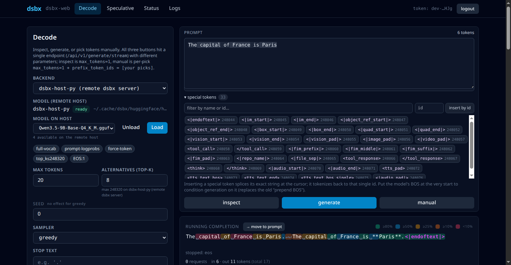
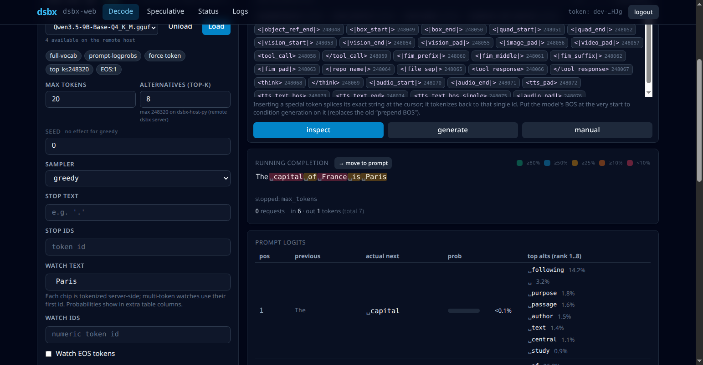
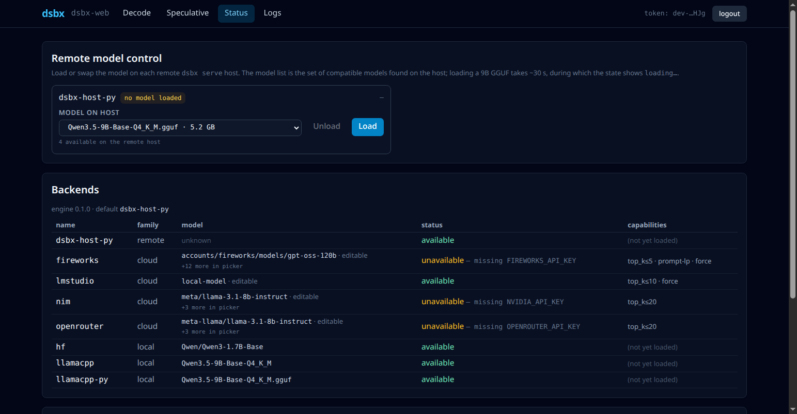
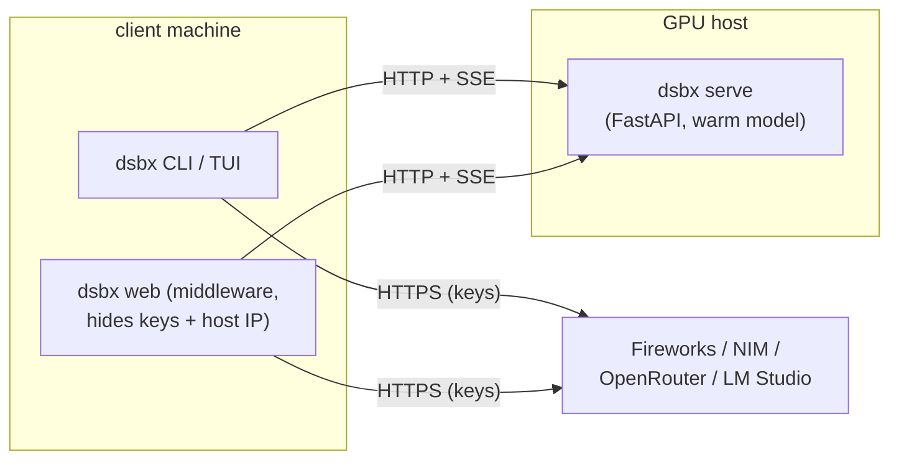

# llm-decoding

**A white-box laboratory for inspecting how LLMs assign probabilities to tokens
— and how decoders turn those probabilities into text — across local models and
logprob-capable cloud providers.**

[](https://github.com/mikhailsal/llm-decoding/actions/workflows/ci.yml)


[](https://github.com/astral-sh/ruff)

[](.pre-commit-config.yaml)
[](LICENSE)



## What it does

Large language models don't "write" text directly. At every position they
produce a score (logit) for every token in their vocabulary; a softmax turns
those scores into a probability distribution, and a *decoder* repeatedly picks
the next token from that distribution. `llm-decoding` makes that hidden process
visible and pokeable.

It is a console- and browser-driven tool to **inspect** the full distribution
at any position, **decode** with a range of samplers while watching how each
choice diverges from greedy, step through generation **one token at a time by
hand**, and run **speculative decoding** with an accept/reject view — against
local HuggingFace and llama.cpp models *and* cloud providers that expose
logprobs (Fireworks, NVIDIA NIM, OpenRouter, LM Studio). It started as a
personal learning project for understanding model internals and grew into a
small, tested, multi-backend system with a SvelteKit web UI.

## Core capabilities

**Per-token confidence + watch tokens.** `inspect` shows, for every position in
a prompt, what the model actually predicted next, how confident it was, and the
top alternatives. The `--watch` family adds a dedicated column tracing the
exact probability of any token (including unprintable EOS/control tokens) across
the whole context.



**Multi-backend, swappable at runtime.** A long-lived server keeps one heavy
model warm on a GPU host; the browser's Status page can load or swap models on
that host without a restart, and shows the live capability envelope of every
configured backend.



Beyond these: **manual token-by-token decoding** (pick by rank, force any token,
undo, save/load a transcript), **custom samplers** (drop in your own decode
function), and **speculative decoding** (HF draft + target with a
tokens-per-target-pass speedup metric).

## Provider logprob support (live-verified, June 2026)

| Provider | chat logprobs | whole-context (prompt) logprobs | notes |
|---|---|---|---|
| **Fireworks** | yes (`top_logprobs` ≤ 5) | **yes** (`/completions` `echo`) | frontier models (gpt-oss-120b, glm, kimi, deepseek); rich [extension fields](docs/fireworks-extensions.md) |
| **NVIDIA NIM** | yes (`top_logprobs` ≤ 20) | no | registered but generation gated off (chat-only) |
| **OpenRouter** | yes (needs `provider.require_parameters`) | no | registered but generation gated off (chat-only) |
| **LM Studio** | yes (`top_logprobs` ≤ 10) | no | local OpenAI-compatible server, no key needed |
| **Local HF transformers** | n/a | **yes** (full `[seq, vocab]`) | full vocabulary, every position |
| **Local llama.cpp (in-process)** | n/a | **yes** (full `[seq, vocab]`) | full vocab for GGUFs HF can't load |
| **Local llama.cpp (HTTP)** | n/a | top-k only | top-k candidates per position |

Chat-only providers (NIM, OpenRouter) stay *registered* — `/api/v1/info` lists
them and the picker shows them disabled with a tooltip — but the decode verbs
refuse to start a session against them with an explanatory 400, because a
per-step "continuation" over `/chat/completions` is not a real continuation.
Re-enabling them behind a proper chat-mode UI is tracked in the issues.

## Architecture



A single `Backend` protocol unifies in-process backends (HF, llama.cpp) and the
HTTP `RemoteBackend`, so every command works identically whether the model runs
locally or on a remote GPU host. The full design — swappable model slot, SSE
wire protocol, the browser middleware's secret-scrubbing, and what was verified
on real hardware — is in [docs/architecture.md](docs/architecture.md).

## Quick start

```bash
git clone https://github.com/mikhailsal/llm-decoding.git
cd llm-decoding
python3 -m venv .venv && source .venv/bin/activate
pip install -e .                      # lightweight core: rich, httpx, openai, ...
cp config.example.toml config.toml    # then add a [remote.NAME] or cloud key

dsbx doctor                           # checks keys, remote servers, and disk
dsbx inspect "The capital of France is" --backend fireworks
```

API keys are read from the environment; `config.toml` can point
`secrets_env_file` at a file holding `FIREWORKS_API_KEY`, `NVIDIA_API_KEY`,
etc. To run local models on a GPU host and the browser UI, see
[docs/architecture.md](docs/architecture.md).

A few representative commands:

```bash
# Per-token confidence with a watch column
dsbx inspect "The capital of France is Paris" --backend hf --watch " London"

# Decode with a sampler, see per-step divergence from greedy
dsbx generate "Once upon a time" --backend llamacpp --sampler top_p --top-p 0.9

# Interactive token-by-token TUI
dsbx manual "The capital of" --backend hf

# Speculative decoding (HF draft + target)
dsbx spec "The capital of France is" --gamma 4

# Browser UI (FastAPI middleware + SvelteKit, served on :8765)
make web-prod
```

The CLI verbs are `doctor`, `probe`, `inspect`, `generate`, `manual`, `spec`,
`serve`, `web`, and `session`; run `dsbx <verb> --help` for the flags. Deeper
guides live in [docs/](docs/): the [EOS & watch-token cookbook](docs/eos-and-watch-tokens.md)
and the [Fireworks extension fields](docs/fireworks-extensions.md).

## Code quality

The project ships the quality signals you'd expect of a maintained codebase,
runnable in one shot:

```bash
make quality-check    # ruff lint + format check, code-size limits, mypy, tests
make coverage         # pytest with an HTML coverage report
pre-commit install    # hygiene + ruff + code-size gate on every commit
```

- **Ruff** for linting and formatting (an extended rule set: bugbear,
  pyupgrade, simplify, pathlib, bandit, ...).
- **mypy** runs informationally (CI doesn't yet gate on it; incremental typing
  is a tracked follow-up).
- **pytest** — 508 tests, 78% line+branch coverage.
- **Code-size limits** (`scripts/check_code_limits.py`) — a phased file-size
  gate (700-line ceiling, large legacy modules grandfathered at their current
  size) plus non-blocking function-length advisories.
- **GitHub Actions** runs all of the above across Python 3.10 and 3.12, plus the
  frontend's vitest + build.

Known issues are tracked in
[GitHub Issues](https://github.com/mikhailsal/llm-decoding/issues).

## Project structure

```
decoding_sandbox/
  core/        config, storage, types, backend protocol, factory, samplers,
               engine, manual stepping, speculative  (no UI deps)
  backends/    hf (full vocab, PyTorch) / llamacpp (top-k via HTTP) /
               llamacpp_py (full vocab, in-process llama.cpp) /
               openai_compat/ (cloud providers) / remote (HTTP+SSE client)
  server/      FastAPI app + wire schemas; the `dsbx serve` swappable slot
  cli/         argparse front-end, rich rendering, manual TUI, session REPL
               commands/ (one module per subcommand)
  web/         FastAPI middleware: auth, sessions, streaming, request logging
frontend/      SvelteKit + TypeScript single-page app (the browser UI)
docs/          architecture, EOS/watch tokens, Fireworks extensions, images
scripts/       host setup + llama.cpp build + smoke tests + code-size checker
examples/      custom_sampler.py
```

## License

[MIT](LICENSE) © 2025 Mikhail Salnikov
