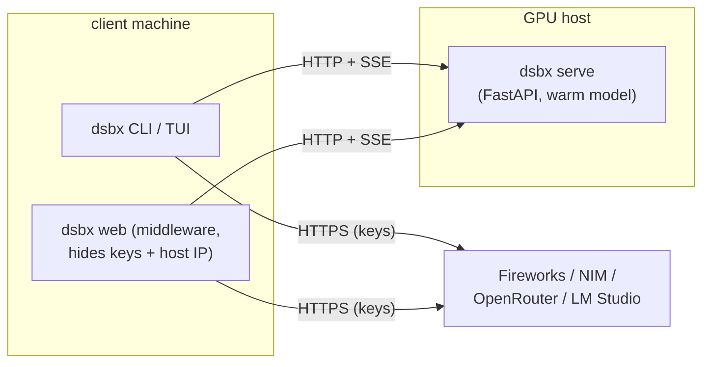

# dsbx (Decoding Sandbox)

**A white-box laboratory for inspecting how LLMs assign probabilities to tokens — and how decoders turn those probabilities into text — across local models and logprob-capable cloud providers.**

[](https://github.com/mikhailsal/dsbx/actions/workflows/ci.yml)


[](https://github.com/astral-sh/ruff)

[](.pre-commit-config.yaml)
[](LICENSE)


## What it does

Large language models don't "write" text directly. At every position, they produce a score (logit) for every token in their vocabulary; a softmax turns those scores into a probability distribution, and a *decoder* repeatedly picks the next token from that distribution. `dsbx` (Decoding Sandbox) makes that hidden process visible, interactive, and pokeable.

## 🚀 Key Technical Highlights

This project was built to study model internals deeply, rather than just wrapping chat APIs.

* **Interactive Manual Decoding:** A flagship feature that breaks the black-box nature of LLMs. You can step through generation one token at a time, see the exact distribution, pick a token by rank, force *any* arbitrary token into the context, step backwards, and watch how your choices diverge from the greedy path. 
* **Dual Interfaces (Web UI & CLI/TUI):** Every core feature is accessible through two distinct interfaces. You can use the interactive terminal TUI for quick hacking, or the modern SvelteKit + TypeScript browser Web UI for a comprehensive visual workbench.
* **Multi-Backend Polymorphism:** A unified `Backend` protocol seamlessly abstracts local in-process models (HuggingFace, llama.cpp) and remote API endpoints (Fireworks, LM Studio). Every command works identically regardless of where the inference runs.
* **Automatic Tokenizer Sync:** Automatically detects and downloads the correct tokenizer (via HuggingFace Hub) even for cloud backends. This exposes the model's true vocabulary, allowing you to view, insert, and trace probabilities for unprintable special/control tokens (like `EOS`) natively.
* **Decoupled Architecture:** Features a heavy GPU-host FastAPI server and a lightweight middleware layer. This setup allows for secure, dynamic hot-swapping of models on the remote host without restarting the server, keeping secrets safe from the client.
* **Deep LLM Internals:** Handles raw logits, custom sampling algorithms (drop in your own decode function), per-token confidence tracking, and speculative decoding experiments.

## Features & Capabilities

**Per-token confidence + watch tokens.** `inspect` shows, for every position in a prompt, what the model actually predicted next, how confident it was, and the top alternatives. The `--watch` family adds a dedicated column tracing the exact probability of any token (including unprintable EOS/control tokens) across the whole context.


**Interactive token-by-token TUI.** Dive into the exact probability tree at any step. `dsbx manual` lets you guide the model manually.

**Multi-backend, swappable at runtime.** The browser's Status page can load or swap models on the GPU host without a restart, and shows the live capability envelope of every configured backend.


## 💼 Real-World Use Cases

Why build a white-box decoder? This tool solves practical problems for ML engineers and AI product teams:

* **Debugging Hallucinations:** Understand *why* a model derailed by inspecting the exact probability distribution and competing tokens at the point of failure.
* **Prompt Engineering Analytics:** Quantify how different prompt formulations shift the probability mass of your target desired answers.
* **Model Evaluation & Quantization:** Compare the raw logits and distributions between a full-precision model and its quantized (e.g., GGUF) counterpart to assess degradation.
* **Custom Sampler Tuning:** Visually tune hyper-parameters (temperature, top-p, top-k) or develop entirely new sampling algorithms by watching their real-time impact on the generated token stream.

## Engineering Standards & CI/CD

The project ships with the quality signals you'd expect of a production-ready, maintained codebase:

* **Testing:** 520 tests written with `pytest` and `pytest-asyncio`, covering 80% of the codebase (line+branch).
* **Advanced Linting:** `ruff` is configured with an extended, strict rule set including `bugbear` (design), `bandit` (security), and `simplify`.
* **Async & Storage:** Uses `FastAPI`, `SQLAlchemy 2.0`, and `aiosqlite` for high-performance asynchronous upstream request logging.
* **Future Work:** AST-based code-size limits (`scripts/check_code_limits.py`) to enforce file-size ceilings and function-length advisories automatically.
* **CI/CD:** GitHub Actions runs all checks across Python 3.10 and 3.12, plus the frontend's vitest and builds. `pre-commit` enforces hygiene locally.

## Provider logprob support (live-verified, June 2026)

| Provider | chat logprobs | whole-context (prompt) logprobs | notes |
|---|---|---|---|
| **Fireworks** | yes (`top_logprobs` ≤ 5) | **yes** (`/completions` `echo`) | frontier models (gpt-oss-120b, glm, kimi, deepseek); rich [extension fields](docs/fireworks-extensions.md) |
| **NVIDIA NIM** | yes (`top_logprobs` ≤ 20) | no | registered but generation gated off (chat-only) |
| **OpenRouter** | yes (needs `provider.require_parameters`) | no | registered but generation gated off (chat-only) |
| **LM Studio** | yes (`top_logprobs` ≤ 10) | no | local OpenAI-compatible server, no key needed |
| **Local HF transformers** | n/a | **yes** (full `[seq, vocab]`) | full vocabulary, every position |
| **Local llama.cpp (in-process)** | n/a | **yes** (full `[seq, vocab]`) | full vocab for GGUFs HF can't load |
| **Local llama.cpp (HTTP)** | n/a | top-k only | top-k candidates per position |

## Architecture



A single `Backend` protocol unifies in-process backends and the HTTP `RemoteBackend`. The full design is in [docs/architecture.md](docs/architecture.md).

## Quick start

```bash
git clone https://github.com/mikhailsal/dsbx.git
cd dsbx
python3 -m venv .venv && source .venv/bin/activate
pip install -e .                      # lightweight core: rich, httpx, openai, ...
cp config.example.toml config.toml    # then add a [remote.NAME] or cloud key

dsbx doctor                           # checks keys, remote servers, and disk
dsbx inspect "The capital of France is" --backend fireworks
```

A few representative commands:

```bash
# Interactive token-by-token TUI
dsbx manual "The capital of" --backend hf

# Per-token confidence with a watch column
dsbx inspect "The capital of France is Paris" --backend hf --watch " London"

# Decode with a sampler, see per-step divergence from greedy
dsbx generate "Once upon a time" --backend llamacpp --sampler top_p --top-p 0.9

# Speculative decoding (HF draft + target)
dsbx spec "The capital of France is" --gamma 4

# Browser UI (FastAPI middleware + SvelteKit, served on :8765)
make web-prod
```

## Project structure

```
dsbx/
  core/        config, storage, types, backend protocol, factory, samplers, engine
  backends/    hf / llamacpp / llamacpp_py / openai_compat / remote
  server/      FastAPI app + wire schemas; the `dsbx serve` swappable slot
  cli/         argparse front-end, rich rendering, manual TUI, session REPL
  web/         FastAPI middleware: auth, sessions, streaming, request logging
frontend/      SvelteKit + TypeScript single-page app (the browser UI)
docs/          architecture, EOS/watch tokens, Fireworks extensions, images
scripts/       host setup + llama.cpp build + smoke tests + code-size checker
examples/      custom_sampler.py
```

## License

[MIT](LICENSE) © 2025 Mikhail Salnikov
