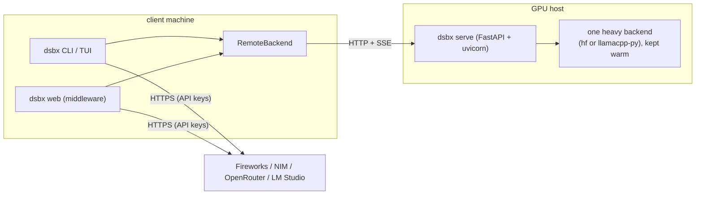
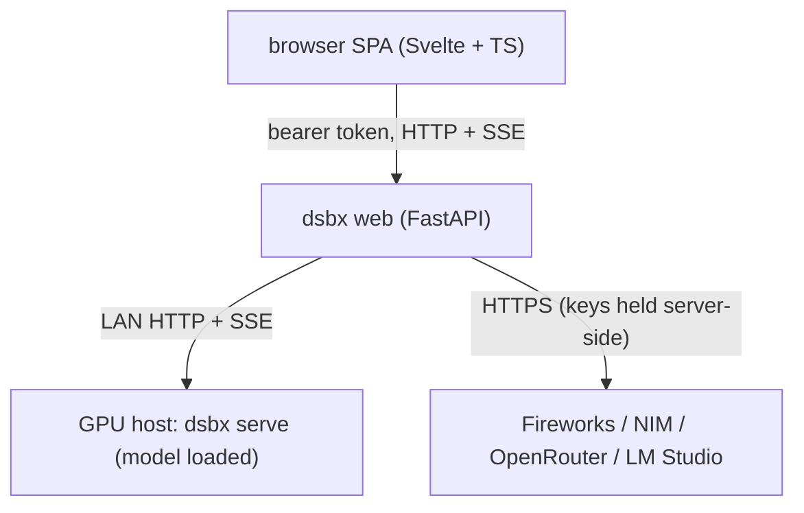

# Architecture

This document covers the moving parts behind `dsbx`: the
client/server split, the HTTP server's swappable model slot, the browser
middleware, and what was verified end-to-end on real hardware.

## Why a client/server split

Loading a 9B GGUF (or a dense HF base) costs 30+ seconds and several GB of
VRAM. Running that per CLI invocation would make the tool unusable. Instead a
long-lived **server** loads exactly one heavy backend at startup and keeps it
warm; the **client** (the CLI/TUI and all cloud-provider traffic) talks to it
over HTTP + SSE.



`RemoteBackend` implements the same `Backend` protocol as the in-process
backends, so every command (`inspect`, `generate`, `manual`, `session`,
`spec`) works against it without branching. `generate` additionally uses
`stream_generate` for incremental SSE rendering when the backend supports it.

## The server: a swappable model slot

Each `dsbx serve` process owns a *swappable model slot* rather than a fixed
model. The slot is a small state machine -- `empty` -> `loading` -> `ready`,
with any load failure landing in `error` (carrying the message) -- and the
loaded model can be changed at runtime.

```bash
# Start empty and pick a model from the browser later:
dsbx serve --backend llamacpp-py --no-preload --host 0.0.0.0 --port 8000

# Or preload (default) and still allow later swaps:
dsbx serve --backend llamacpp-py --host 0.0.0.0 --port 8000
```

Endpoints (consumed by the web UI, scriptable directly):

- `GET /v1/status` -- live slot state, the loaded model, any error, and the
  capability envelope when ready.
- `GET /v1/models` -- the host's catalogue of *compatible* models: every
  `*.gguf` under `[local.llamacpp_py].model_search_dirs` for `llamacpp-py`,
  or the configured `[local.hf].models` list for `hf`.
- `POST /v1/reload {"model": "<id>"}` -- close the current model and load
  `<id>` on a background thread. Returns immediately with `state: loading`;
  poll `/v1/status` until terminal.

Because a small 6 GB GPU can't hold two 9B models at once, a reload closes the
old model *before* building the new one; a failed reload therefore leaves the
slot `empty`/`error` rather than silently falling back. Inference requests
during `loading`/`empty`/`error` return HTTP `409` with an explanatory
`detail`.

`--host 0.0.0.0` is opt-in (a warning is printed); the default `127.0.0.1` is
loopback-only. The server has no auth of its own, so keep that box on a
trusted network or front it with `dsbx web`.

## The browser middleware (`dsbx web`)

The browser UI is a SvelteKit single-page app served by `dsbx web` -- a small
FastAPI **middleware** that fronts every configured backend behind a single
bearer-token API. The browser never sees provider API keys, the GPU host's
address, or anything in `secrets_env_file`; it only knows the address of
`dsbx web` and the token to talk to it.



The UI mirrors every CLI verb: `/inspect`, `/generate`, `/manual`, `/spec`,
and `/status` (which combines `doctor` + `probe`). Streaming token output uses
SSE end-to-end; manual-decoding state lives on the middleware in a UUID-keyed,
TTL-evicted session registry.

### Remote model control

The `/status` page hosts a **Remote model control** card for every
`[remote.NAME]` backend (see the screenshot in the main README). Each card
shows the host's live slot state, a picker populated from that host's
compatible-model catalogue, and a Load/Reload button. The card polls the host
every ~2 s while `loading` and refreshes the UI's capability envelopes once the
new model is `ready`. The middleware proxies this through two scrubbed
endpoints -- `GET /api/v1/backends/{name}/status` and
`POST /api/v1/backends/{name}/reload` -- which forward to the host's `/v1/status`
and `/v1/reload`. Errors are sanitized so the host address never reaches the
browser, and both endpoints 400 for non-remote families.

### What is and isn't exposed

The middleware actively scrubs the `base_url` of every `[remote.NAME]` entry,
every environment-resolved API key, and the `secrets_env_file` path. The
browser only ever receives opaque backend names with their `Capabilities`
flags, the token-level outputs of the decode verbs, probe status strings, and
(for remote hosts) the model catalogue and slot state. The no-secrets-leak
invariant is enforced by `tests/test_web_info.py`, which scans every
`/api/v1/info` payload for known sentinel values.

## Backends and capabilities

What you can observe depends on the backend's `Capabilities`:

| Backend | runs | observability |
|---|---|---|
| `hf` (HuggingFace transformers) | in-process, PyTorch | full `[batch, seq, vocab]` logits at every position; custom samplers, manual stepping, speculative |
| `llamacpp-py` (in-process llama.cpp) | in-process, `logits_all=True` | full `[seq, vocab]` matrix via `Llama.scores` for GGUFs HF can't load |
| `llamacpp` (llama.cpp HTTP) | remote HTTP | top-k candidates per position |
| `openai_compat` (cloud) | HTTPS | generated-token top-k; whole-context via Fireworks `echo` |
| `remote` (`dsbx serve` client) | HTTP + SSE | mirrors whatever the hosted backend exposes |

`transformers` returns `outputs.logits` of shape `[batch, seq_len, vocab_size]`
from a single forward pass -- the full distribution at every position, prompt
included. The in-process `llama-cpp-python` binding (compiled against the same
CUDA build as `llama-server`, initialized with `logits_all=True`) exposes the
equivalent `[seq, vocab]` matrix via `Llama.scores` for **GGUF models HF can't
load** (e.g. a 9B base on a 6 GB GPU, where the bitsandbytes + accelerate
meta-tensor path breaks on the hybrid architecture). KV-cache is reused when
subsequent calls extend the previous context, so manual stepping stays cheap.

## Storage

Model weights are large (multi-GB GGUFs and 4-bit safetensors), so the tooling
keeps the system disk clear:

- Active model files: wherever the host has fast local storage.
- Bulk caches (`HF_HOME`, pip): pointed at a roomy cache dir (default
  `~/.cache/dsbx`) via `config.toml` or `scripts/setup_host.sh`.
- `dsbx doctor` runs a free-space preflight (`storage.preflight_or_raise`)
  before any heavy work; bypass with `--skip-preflight`.

## What was verified on hardware

The whole pipeline was validated end-to-end on a Linux box with a small 6 GB
NVIDIA GPU (Pascal class):

- **llama.cpp + CUDA** built for the GPU (g++-12 host compiler). The
  Qwen3.5-9B-Base Q4_K_M GGUF loads (hybrid Gated DeltaNet), `-ngl 20` / ctx
  4096 uses ~3.6 GB VRAM at ~11 tok/s, and `/completion n_probs` returns top-k
  logprobs.
- **HF transformers** white-box engine works with a dense base (full vocab
  151936, whole-context teacher forcing). The 9B base does **not** load in
  4-bit on 6 GB (the meta-tensor bug above), so it is served by
  `llamacpp`/`llamacpp-py` and HF runs a smaller dense base.
- **`llamacpp-py`** closes the gap: the 9B Q4 GGUF runs on the same CUDA build
  and exposes the full `[seq, vocab]` logits tensor, so
  `inspect`/`generate`/`manual`/`spec` get the same white-box features HF gives
  for smaller models.
- **Cloud**: Fireworks chat `top_logprobs` + whole-context `echo` (frontier
  models); NIM and OpenRouter generated-token logprobs (OpenRouter needs
  `require_parameters`); Gemini AI Studio deferred (logprobs gated off).
